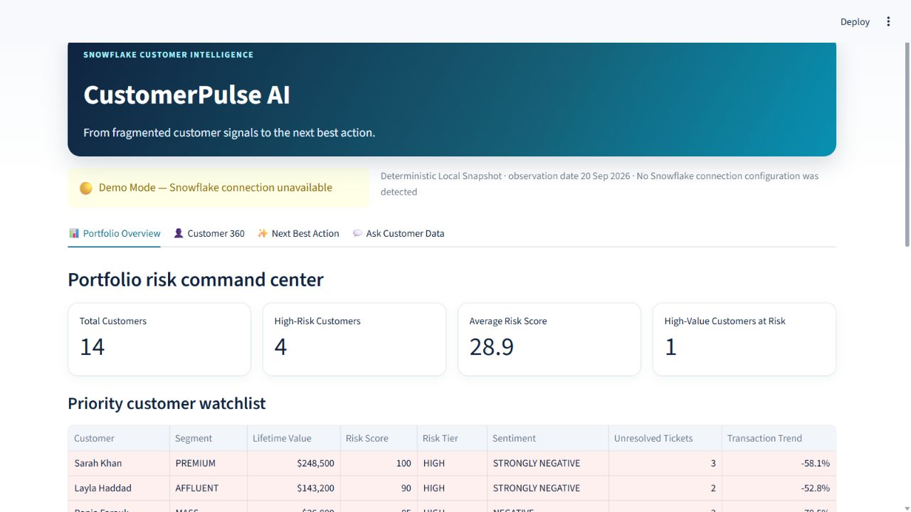
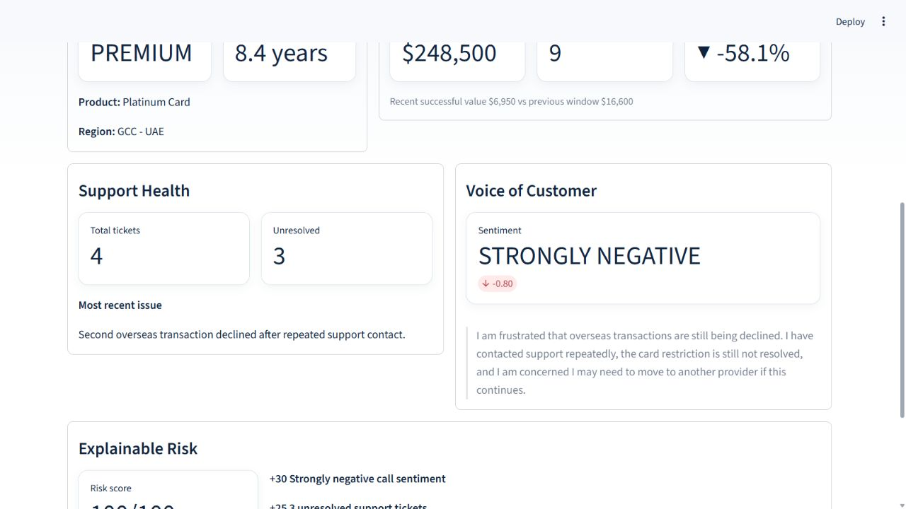
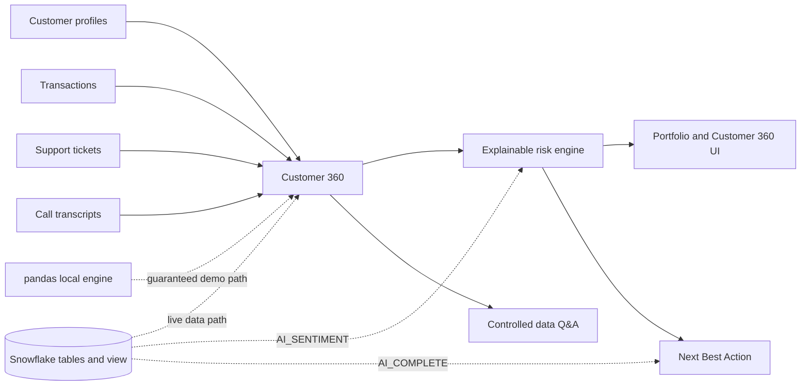

# CustomerPulse AI

> From fragmented customer signals to the next best action.

CustomerPulse AI is a runnable Customer 360 and retention decision engine built for the **Snowflake CoCo CLI Hackathon — GCC Edition, Challenge 02**. It joins customer profiles, transactions, support tickets, and call transcripts into an explainable risk score and an operational Next Best Action.

## 1. Problem

High-value customer risk is rarely visible in one system. Declining transaction activity may sit in payments data, unresolved friction in a case platform, and churn language in a call transcript. Retention teams often discover the pattern only after the customer leaves.

## 2. Solution

CustomerPulse AI creates one evidence-grounded customer view, scores four transparent risk dimensions, and turns the result into a prioritized intervention. A Snowflake-backed path supports centralized analytics and live AI; an equivalent pandas engine keeps the demo reliable without credentials.

## 3. Why it matters

- Finds high-value relationships with compounding risk signals.
- Makes every risk point traceable to customer evidence.
- Gives service teams an action, outreach draft, and business objective.
- Preserves a functional local workflow when cloud access is unavailable.

## 4. Key features

- Portfolio command center with risk and value prioritization.
- Customer 360 across profile, value, support, and voice signals.
- Deterministic 0–100 risk score with visible contributions.
- Snowflake `AI_COMPLETE` recommendations when access is available.
- Current `AI_SENTIMENT` enrichment view for supported Snowflake regions and roles.
- Polished deterministic explanation and Next Best Action fallback.
- Controlled natural-language questions grounded in the loaded data.

## 5. Demo

Sarah Khan is the primary story: a long-standing premium customer with high lifetime value, a transaction-value decline greater than 40%, repeated recent payment failures, three unresolved/escalated tickets, and strongly negative latest-call sentiment. The combined rule stack produces a **100/100 HIGH** risk score.

Run the demo:

```bash
streamlit run app.py
```

If the `streamlit` executable is not on `PATH`:

```bash
python -m streamlit run app.py
```





## 6. Architecture

The app separates source data, analytics, optional Snowflake connectivity, recommendation generation, and presentation. Local and Snowflake paths implement the same business rules so a judge can inspect the logic and still run the product offline.

## 7. Mermaid architecture diagram



See [submission/ARCHITECTURE.md](submission/ARCHITECTURE.md) for component details.

## 8. Data model

| Dataset | Rows | Purpose |
|---|---:|---|
| `customers.csv` | 14 | Identity, segment, relationship, product, value |
| `transactions.csv` | 100 | Successful and failed activity across comparable windows |
| `support_tickets.csv` | 30 | Resolved, open, and escalated service issues |
| `call_transcripts.csv` | 18 | Latest voice-of-customer evidence |

All data is deterministic synthetic data generated by `python scripts/seed_data.py` with a fixed random seed.

## 9. Explainable risk engine

The observation date is the latest transaction date. Recent and previous windows are 90 days each; transaction value includes successful transactions only.

| Signal | Rule | Points |
|---|---|---:|
| Sentiment | strongly negative / moderately negative | 30 / 15 |
| Unresolved tickets | at least 2 / exactly 1 | 25 / 10 |
| Transaction change | at most -40% / at most -20% | 25 / 15 |
| Recent failed transactions | at least 2 / exactly 1 | 20 / 10 |

Scores are capped at 100. LOW is 0–34, MEDIUM is 35–64, and HIGH is 65–100. `src/analytics.py` returns both the score and every contribution.

## 10. Snowflake integration

The default namespace is `CUSTOMERPULSE_DB.APP`. SQL files create project-only tables, seed the deterministic data, build `CUSTOMER_360`, and provide validation queries. `scripts/setup_snowflake.py` tries that namespace first and falls back to the connection's current accessible database/schema if create privileges are unavailable. It never drops a database, schema, warehouse, role, or user.

Connection priority is:

1. `connections.toml` / named Snowflake connection;
2. Snowflake environment variables;
3. local demo mode.

Connection failures are reduced to non-secret diagnostics and never stop the Streamlit app.

## 11. Snowflake AI usage

The optional `CUSTOMER_360_AI` view calls current `AI_SENTIMENT` and retains its object result. The application calls current `AI_COMPLETE(model, prompt)` for concise explanations and structured recommendations. Prompts restrict output to supplied evidence and prohibit invented facts. Roles need the appropriate Cortex AI privileges and regional availability; setup safely skips only the optional AI view if it is unavailable.

References: [AI_SENTIMENT documentation](https://docs.snowflake.com/en/sql-reference/functions/ai_sentiment), [AI_COMPLETE documentation](https://docs.snowflake.com/en/sql-reference/functions/ai_complete).

## 12. CoCo CLI usage

The environment used to build and validate this repository did not have a `cortex` or `snow` executable, so no CoCo task was fabricated. The exact result and a safe proposed review task are recorded in [COCO_USAGE.md](COCO_USAGE.md).

## 13. Local demo mode

When Snowflake configuration is absent or a connection fails, the banner reads **🟡 Demo Mode — Snowflake connection unavailable**. pandas performs the complete Customer 360 aggregation, lexical sentiment fallback, scoring, Q&A, and deterministic recommendation. Deterministic output is explicitly labeled and is never presented as model-generated.

## 14. Installation

Python 3.11 or newer is required.

```bash
python -m venv .venv
# Windows PowerShell
.venv\Scripts\Activate.ps1
python -m pip install -r requirements.txt
```

## 15. Running locally

```bash
python scripts/smoke_test.py
streamlit run app.py
```

The four tabs are Portfolio Overview, Customer 360, Next Best Action, and Ask Customer Data. Sarah Khan is selected by default on the two customer-focused tabs.

## 16. Snowflake setup

Use either a standard Snowflake `connections.toml` profile or environment variables listed in `.env.example`. Do not put credentials in source control.

```bash
python scripts/setup_snowflake.py
```

For direct SQL execution, run `00_setup.sql`, `01_tables.sql`, `02_seed.sql`, `03_customer_360.sql`, and `04_validation.sql` in order. A role that uses AI functions needs Snowflake Cortex access; the base deterministic `CUSTOMER_360` view does not require an AI model.

## 17. Testing

```bash
python -m pytest -q
python scripts/smoke_test.py
python -m compileall -q app.py src scripts tests
```

Tests cover score composition, tier boundaries, time windows, aggregation, Sarah's scenario, fallback labeling, and dataset integrity.

## 18. Hackathon challenge mapping

| Challenge expectation | CustomerPulse AI evidence |
|---|---|
| Unified Customer 360 | Four datasets joined locally and in Snowflake SQL |
| Structured + unstructured signals | Transactions/tickets plus call transcripts |
| Customer risk | Transparent deterministic score and tier |
| Snowflake AI | Current AI functions behind permission-safe optional paths |
| Next Best Action | Prioritized action, reason, outreach, and objective |
| Demo reliability | Full local path with no credentials required |

## 19. Limitations

- Synthetic data is intentionally small and is not a production performance benchmark.
- Local sentiment is a deterministic phrase-based classifier, not a general language model.
- The Q&A tab supports a controlled set of analytical intents rather than arbitrary SQL generation.
- Live Snowflake and Snowflake AI behavior depends on account configuration, role grants, model access, and region; it was not validated in the build environment.
- CoCo CLI was not installed in the build environment.

## 20. Future roadmap

- Replace batch CSV inputs with governed Snowflake ingestion pipelines.
- Add model and rule performance monitoring against confirmed retention outcomes.
- Stream recommendations into a CRM work queue with owner and SLA tracking.
- Add consent, policy, and offer-eligibility checks before customer outreach.
- Evaluate multilingual voice signals for GCC customer-service operations.
