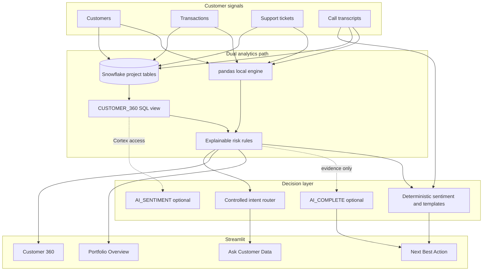

# CustomerPulse AI Architecture

## Components

- **Sources:** Four deterministic synthetic CSVs create a realistic but non-sensitive demo. `scripts/seed_data.py` regenerates both CSV and Snowflake seed SQL.
- **Local analytics:** `src/data.py` validates schemas and foreign keys. `src/analytics.py` calculates two comparable 90-day windows, aggregates support, selects the latest call, classifies local sentiment, and scores risk.
- **Snowflake analytics:** `sql/01_tables.sql` through `sql/04_validation.sql` create project objects, seed data, reproduce the Customer 360, and validate Sarah's story. Namespace creation has a permission-safe fallback.
- **AI layer:** `src/ai.py` constrains live Snowflake prompts to supplied JSON evidence. Any AI failure returns an explicitly labeled deterministic explanation and recommendation.
- **Application:** `app.py` provides four focused workflows. `src/ui.py` holds formatting and a controlled question router that can only return loaded customer values.

## Reliability and security boundaries

- Missing Snowflake credentials never prevent local startup.
- Credentials are read from standard configuration or environment variables and are never logged.
- No project SQL drops shared databases, schemas, warehouses, roles, or users.
- Live AI output is distinct from deterministic output in the interface.
- Risk decisions retain individual point contributions for auditability.

